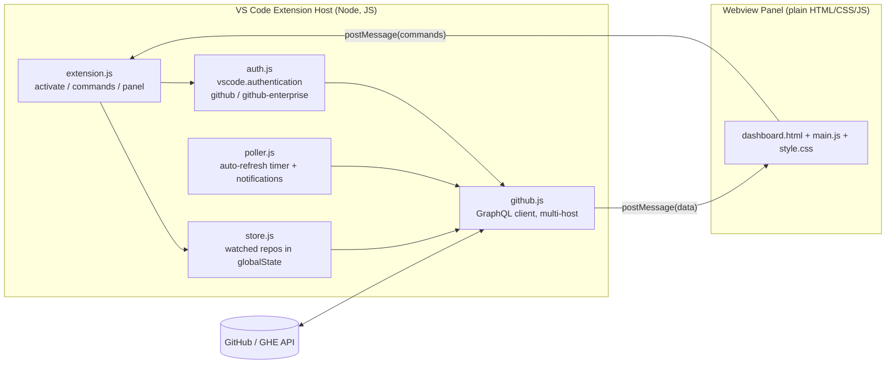

# PR Dashboard — Design

## Goals

- One panel to monitor **open pull requests** across multiple repositories.
- Users pick which repos to watch; the list is **persisted in app data**.
- Works against **GitHub.com** and **GitHub Enterprise Server**.
- Authenticate with **OAuth** via VS Code's built-in GitHub auth (no PAT handling).

## Non-goals (v1)

- Azure DevOps support.
- Writing/merging PRs from the dashboard (read-only monitoring + open-in-browser).
- Multi-account per host.

## High-level architecture



All network and secret handling lives in the **extension host**. The **webview** is pure
presentation and communicates only through `postMessage`, keeping it CSP-safe.

## Components

| File | Responsibility |
|---|---|
| `app/src/extension.js` | `activate()`, register the `prDashboard.open` command, create/manage the webview panel, wire host↔webview messages, own the data refresh loop. |
| `app/src/auth.js` | Resolve an auth session/token for a given host via `vscode.authentication.getSession`. Chooses `github` for github.com and `github-enterprise` for GHE hosts. |
| `app/src/store.js` | CRUD for the watched-repo list in `context.globalState`. Parses `owner/repo` and full URLs into a normalized entry. |
| `app/src/github.js` | Build and execute GraphQL queries against the right API endpoint; normalize PR data for the UI. |
| `app/src/poller.js` | Timer-based refresh; diff results to detect newly "needs my review" PRs and raise notifications. |
| `app/media/*` | Webview: render repos/PRs, filter bar, add/remove UI; send commands to host. |

## Data model

### Watched repo (persisted in globalState under key `watchedRepos`)

```json
{
  "id": "github.com/owner/repo",
  "host": "github.com",
  "owner": "owner",
  "name": "repo",
  "addedAt": "2026-06-03T10:00:00Z"
}
```

For GitHub Enterprise the `host` is the GHE domain, e.g. `github.mycompany.com`, and the
API base becomes `https://<host>/api/graphql`.

### Normalized PR (host → webview, not persisted)

```json
{
  "repoId": "github.com/owner/repo",
  "number": 123,
  "title": "Fix flaky test",
  "url": "https://github.com/owner/repo/pull/123",
  "author": "octocat",
  "isDraft": false,
  "checksStatus": "success",        // success | failure | pending | none
  "reviewStatus": "review_required", // approved | changes_requested | review_required
  "mergeable": "MERGEABLE",          // MERGEABLE | CONFLICTING | UNKNOWN
  "labels": ["bug", "p1"],
  "reviewers": ["me", "teammate"],
  "needsMyReview": true,
  "updatedAt": "2026-06-03T09:30:00Z"
}
```

## Storage

VS Code persists extension state under app data automatically:

- **Windows:** `%APPDATA%\Code\User\globalStorage\<publisher>.pr-dashboard\`
- Watched list lives in `context.globalState` (JSON, key `watchedRepos`).
- The **OAuth token is never stored by the extension** — it is requested on demand and
  cached by VS Code's authentication provider in the OS secret store.

## Authentication

- github.com → `vscode.authentication.getSession('github', ['repo','read:org'], { createIfNone })`.
- GitHub Enterprise → provider id `github-enterprise` (requires VS Code's
  `github-enterprise.uri` setting). Scopes are the same.
- The session's `accessToken` is used as a `Bearer` token on API requests.

## Fetching PR data (GraphQL)

One query per repo returns PRs plus the data the UI needs, minimizing round-trips:

```graphql
query($owner: String!, $name: String!) {
  viewer { login }
  repository(owner: $owner, name: $name) {
    pullRequests(states: OPEN, first: 50, orderBy: {field: UPDATED_AT, direction: DESC}) {
      nodes {
        number title url isDraft mergeable updatedAt
        author { login }
        reviewDecision
        labels(first: 10) { nodes { name } }
        reviewRequests(first: 10) { nodes { requestedReviewer { __typename ... on User { login } } } }
        commits(last: 1) { nodes { commit { statusCheckRollup { state } } } }
      }
    }
  }
}
```

Derivations:

- `checksStatus` ← `statusCheckRollup.state` (SUCCESS/FAILURE/PENDING/EXPECTED/ERROR → normalized).
- `reviewStatus` ← `reviewDecision`.
- `needsMyReview` ← `viewer.login` appears in `reviewRequests`.
- `mergeable` ← `mergeable`.

## Host ↔ Webview message protocol

```
host → webview:  { type: 'data', repos, prs, me }
host → webview:  { type: 'loading' }
host → webview:  { type: 'error', message }

webview → host:  { type: 'ready' }
webview → host:  { type: 'addRepo', value }
webview → host:  { type: 'removeRepo', id }
webview → host:  { type: 'refresh' }
webview → host:  { type: 'openPR', url }
webview → host:  { type: 'setFilter', filter }   // {author, reviewer, label, mineOnly}
```

Filtering by author/reviewer/label and the "needs my review" toggle are applied
**client-side** in the webview for instant response; refresh/auto-refresh re-pull data.

## Auto-refresh & notifications

- `poller.js` runs on `prDashboard.refreshIntervalMinutes` (0 disables).
- After each refresh, PRs newly satisfying `needsMyReview` (not seen in the previous
  snapshot) trigger `window.showInformationMessage` when `prDashboard.notifyOnReviewRequest`
  is enabled. Clicking the notification opens the PR.

## Settings (contributes.configuration)

| Key | Type | Default | Description |
|---|---|---|---|
| `prDashboard.refreshIntervalMinutes` | number | 5 | Auto-refresh interval; 0 disables. |
| `prDashboard.notifyOnReviewRequest` | boolean | true | Notify when a PR newly needs your review. |

## Security

- Webview uses a strict CSP with a per-load nonce; no inline scripts except the nonce'd bundle.
- `localResourceRoots` limited to `app/media`.
- Tokens never cross into the webview; only normalized, non-secret PR data is posted.
- Network calls go only to the configured GitHub/GHE GraphQL endpoints.

## Error handling

- Auth cancelled → show a "Sign in to load PRs" empty state with a retry action.
- Repo not found / no access → per-repo error chip, other repos still render.
- Rate limiting / network errors → error banner with retry; previous data kept visible.

## Future enhancements

- Azure DevOps provider.
- Per-repo saved filters and grouping by "needs my review".
- Tree view contribution in the Activity Bar in addition to the panel.
- Caching last snapshot to `globalStorageUri` for instant cold-start render.
